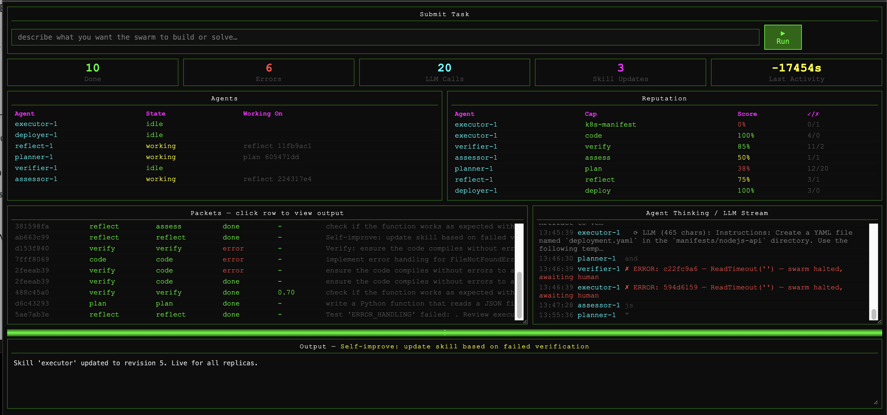
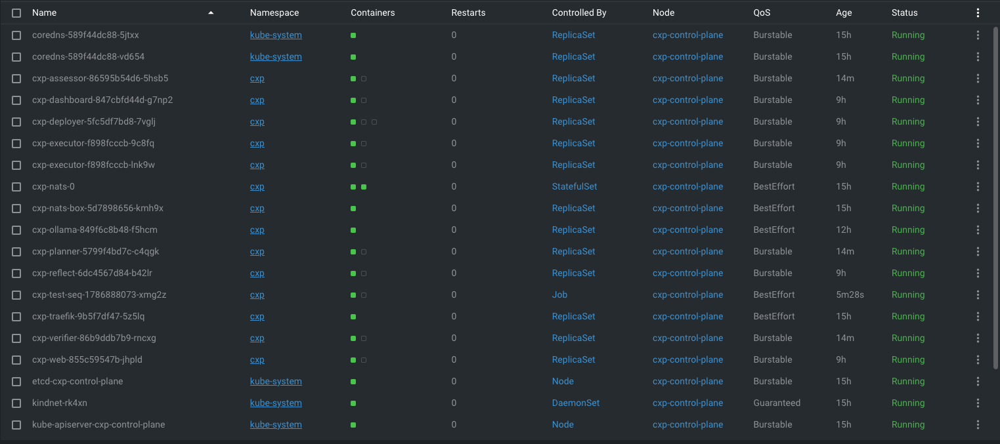

# CXP — Context Exchange Protocol

A self-improving distributed AI swarm: small local LLMs (via Ollama) passing structured packets through a routing layer, testing themselves hourly, and rewriting their own skill files when they fail. Prototype — built to explore the pattern, not production-hardened.

> **Naming note:** "Protocol" is aspirational right now. What exists is a well-defined internal message *schema* (`src/packet.py`'s `CXPPacket`) that this one Python codebase uses to talk to itself across pods — there's no spec independent of that class, no schema version number, and nothing outside this repo has ever produced or consumed a CXP packet. See [docs/architecture.md](docs/architecture.md#is-this-actually-a-protocol) for what it'd take to actually earn the name.

---

## How it works

```
human (or CronJob) submits task
       ↓
  planner agent        decomposes goal → spawns sub-packets (cap: plan)
       ↓
  executor agent(s)    generates artifact — code, YAML, config (cap: code)
       ↓
  verifier agent       scores output 0.0–1.0, spawns reflect if score < threshold (cap: verify)
       ↓
  assessor agent       labels artifact with capability tags (cap: assess)
       ↓
  deployer agent       kubectl-applies YAML / runs code, if score ≥ 0.85 (cap: deploy)
       ↓
  reflect agent        rewrites skill file based on failure (cap: reflect)
       ↓
  next run is smarter
```

All agents communicate over **NATS JetStream** using **CXP packets** — typed, traced, immutable events routed by capability subject (`cxp.cap.plan`, `cxp.cap.code`, etc). Reputation scores route future work to the best-performing agent for each capability.

**No OpenAI. No Anthropic. All local via Ollama** for every agent's own LLM calls (this codebase was built with Claude's help — the swarm's runtime model is a small local Ollama model, not Claude).

If any agent hits an unhandled error, the swarm **halts swarm-wide** — new task submissions are rejected with a clear reason until a human clicks "Resume" in the web UI. It no longer just logs the failure and keeps going. A `diagnostician` agent investigates every halt automatically and attaches a real diagnosis (root cause + suggested action) to the halt banner — including flagging when the same failure class has recurred multiple times recently — but it never clears the halt itself. Awareness, not unilateral resolution: a deliberate call, since even a well-understood, frequently-seen failure could be an early sign of something worse, and the swarm shouldn't decide that on its own.

---

## Screenshots

**Web dashboard** (`http://localhost`) — live agent state, reputation per capability, packet history, and the LLM thinking stream. The red banner and error trace here show the halt gate catching a real `ReadTimeout` from Ollama under concurrent load:



**The swarm's pods in `kubectl get pods`** — one Deployment per agent role, `cxp-nats` for JetStream, `cxp-ollama` for inference, and a `cxp-test-*` Job from the hourly self-test CronJob:



---

## Hardware requirements

- **Realistic minimum: 10-core CPU, 8GB RAM, 10GB disk.** This isn't a conservative guess — it's what this project has actually been run on. Ollama alone was observed running two loaded-model runner processes simultaneously at ~470% CPU *each* (nearly the entire node) before resource limits were added; on anything smaller, expect the same contention (timeouts, even real `500` errors from Ollama itself under load) that this project hit and fixed. There are now **two Ollama instances**, split by model rather than shared: the main one (`qwen2.5:1.5b`, serving planner/executor/verifier/reflect) capped at 3.5 CPU/3Gi, and a smaller dedicated one (`qwen2.5:0.5b`, `assessor` only) at 1.5 CPU/1.5Gi — combined, about the same total budget the single shared instance had before, just no longer colliding when `assessor` and `reflect` fire at the same instant (which happens on every single verifier pass). Tune down only if you also reduce how many agents/models are in play.
- Current setup uses `qwen2.5:1.5b` (assessor uses the smaller `qwen2.5:0.5b`) — small models chosen to run comfortably on modest hardware, at the cost of occasionally malformed JSON output (planner is the most sensitive to this).
- Bigger/better models: edit `helm/cxp/values.yaml` per-agent `model:` field; any Ollama-compatible model works. Check actual headroom first (`docker exec <kind-node> sh -c 'nproc; free -h'`) — a bigger model needs more of both, on top of what's already tightly budgeted here.
- **`metrics-server` is installed on the cluster** (not part of the Helm chart — installed once via `kubectl apply` against the official manifest, patched with `--kubelet-insecure-tls` for kind's self-signed kubelet certs), so `kubectl top nodes`/`kubectl top pods` work for real-time CPU/memory — the same signal that found the original resource-starvation root cause, now available on demand instead of only via `docker exec <kind-node> sh -c uptime`.

---

## Quick start

**Requirements:** Docker Desktop, kind, kubectl, helm

```bash
git clone git@github.com:peterkrentel/cxp.git
cd cxp
make reset    # creates kind cluster with correct port mappings + deploys everything
```

Then open **http://localhost** (Traefik ingress, no port-forward needed).

This project runs **only in the local kind cluster** — there is no supported "run it locally outside Kubernetes" mode.

---

## Submitting tasks

Via web UI at **http://localhost** — type goal, press Enter.

Via CLI:
```bash
make submit GOAL="generate a Kubernetes Deployment for a Node.js API with health checks"
```

If the swarm is currently halted (see below), submission is rejected with a 409 and the halt reason — clear it from the UI first.

---

## Controlled improvement loop

The swarm does not apply an LLM-proposed prompt rewrite directly. Its improvement loop is evidence-gated:

1. Planner, executor, verifier, and assessor output passes through typed contracts. The platform retains raw and normalized output in durable attempt memory.
2. Contract failures and deterministic validator failures can create role-specific candidates in `cxp-skill-candidates`; platform failures and judgment-only results cannot enter automatic evaluation.
3. After the hourly suite, the test Job evaluates at most one eligible **executor** candidate on deterministic held-out tasks against the active skill.
4. The comparison rejects insufficient evidence, platform-unhealthy sources, regressions, and no-improvement results. Its report is written to `cxp-candidate-evaluations` and `tests/results/`.
5. The dashboard shows the report. Only a human promotion writes recommended content to `cxp-skills`; that report records the applied revision and timestamp.

A held-out comparison run (or any request carrying an unvetted `candidate_id`) never triggers `deploy`, never stages a new candidate on failure, and never writes to episodic memory — the verifier suppresses all three side effects for that traffic, so the hourly candidate-comparison job can't accidentally deploy to `cxp-sandbox` or pollute the regression baseline on its own.

Planner and verifier candidates remain staged for review until they have their own isolated evaluation paths.

Inspect active skills, staged candidates, and evaluation reports:
```bash
kubectl exec -n cxp deploy/cxp-nats-box -- nats kv get cxp-skills executor
kubectl exec -n cxp deploy/cxp-nats-box -- nats kv history cxp-skills executor
kubectl exec -n cxp deploy/cxp-nats-box -- nats kv ls cxp-skill-candidates
kubectl exec -n cxp deploy/cxp-nats-box -- nats kv ls cxp-candidate-evaluations
```

---

## Swarm halt on error

Any unhandled agent exception sets a shared halt flag (`cxp-state` KV bucket, key `halt`) with the failing agent, packet, and reason. While halted:
- Every agent stops processing new packets (checked at the top of `agent_shell.py`'s message handler) — except `diagnostician`, which is specifically exempt (`BYPASS_HALT_CHECK = True`) so it can investigate while everyone else is frozen
- `POST /api/submit` returns `409` with the halt reason instead of queuing new work
- The web dashboard shows a red "⛔ SWARM HALTED" banner with the reason, and (once the diagnostician finishes) a diagnosis + suggested action, plus a **Resume** button

**The `diagnostician` agent investigates every halt but never clears one itself.** For a plain network/LLM timeout, it checks `kubectl top` and Ollama's own `/api/ps` and writes a diagnosis built from that evidence — deliberately without an LLM call gating it (that call would itself be vulnerable to the same Ollama overload being diagnosed) — including flagging if the same failure class has recurred multiple times in the last 15 minutes. For anything else (malformed JSON, malformed code, any other exception), it produces an LLM-authored diagnosis instead. Either way, the halt stays active until a human clears it — awareness, not unilateral resolution, by deliberate choice (2026-08-17): even a well-understood, frequently-recurring failure could be an early sign of something worse, and that call belongs to a human, not the swarm.

Clear it manually if needed:
```bash
curl -X POST http://localhost/api/halt/clear
```

---

## Autonomous testing

A **CronJob** runs the test suite hourly inside the cluster. Full detail lives in [`tests/STRATEGY.md`](tests/STRATEGY.md); short version:

- **SMOKE.** One trivial task ("print hello world"), always run first regardless of which difficulty tier below is active. A failure here means the pipeline itself is broken — a different, more urgent signal than "bad at capability X" — but the suite still continues for more signal rather than aborting.
- **A difficulty ladder — `TIER_0_TESTS` → `TIER_1_TESTS` → `TIER_2_TESTS` → ...** — the same 8 [assessor capability labels](#ai-capability-labeling) (`CODE_GENERATION`, `ERROR_HANDLING`, `STRUCTURED_OUTPUT`, `DECOMPOSITION`, `SECURITY_AWARENESS`, `INFRA_AS_CODE`, `TESTING`, `DOCUMENTATION` — `SELF_IMPROVEMENT` doesn't fit the pass/fail shape), each tier strictly harder than the last. `TIER_0_TESTS` starts genuinely minimal; `TIER_1_TESTS` is today's original 8; `TIER_2_TESTS` is harder still, grounded in goals this swarm has actually been observed attempting historically, not invented difficulty. Only one tier runs per CronJob invocation — `check_plateau.py` reads the git-tracked run history *before* anything is submitted and promotes to the next tier automatically once the current one clears **10 consecutive clean runs** (`STREAK_TARGET`), no manual reconfiguration. The ladder is open-ended: adding a `TIER_3_TESTS` later is just appending a new list, no promotion-logic changes needed. Each test retries once on failure, and failures trigger reflect, categorized by timeout / format / quality (plus a catch-all for anything uncategorized).
- **Regression check.** Compares this run's average `code`-capability score against recent history in episodic memory (the same PVC agents write to). A real drop since the last skill revision — not just "missed today's threshold" — triggers a distinct `REGRESSION` reflect task. Independent of the difficulty ladder above.
- **Candidate evaluation.** After the ordinary suite, the Job evaluates at most one eligible executor candidate on four deterministic held-out Tier 0 cases (`CODE_GENERATION`, `ERROR_HANDLING`, `STRUCTURED_OUTPUT`, `TESTING`). It is skipped when no candidate meets the evidence policy and never promotes a skill itself.

All of this runs fully sequentially (one task submitted at a time, waiting for it to settle before the next — running them concurrently piled up enough simultaneous LLM calls to blow past Ollama's read timeout), and checks the swarm's halt state before every single submission — if the swarm halts mid-run, remaining tests are marked `SKIPPED` (not `FAIL`) and reflect-triggering is skipped, instead of cascading into a wall of 409s that reads as a false capability regression.

Results (tagged with which tier ran) are written to `tests/results/`, then cloned and pushed to a dedicated **`bot/test-results` branch — never `main` directly** (the bot racing a human's own push to `main` is exactly what happened once already; a human merges that branch in whenever they choose). The push step also runs [`check_plateau.py`](tests/check_plateau.py), which reports every tier's streak toward its own 10-consecutive-clean-run promotion, and publishes a summary to NATS KV so the currently-active tier and streak progress are visible on the dashboard too (the dashboard pod has no git credentials of its own to read the results history directly). The Job deletes itself only *after* the push completes, and only if every test passed — kept around for debugging on failure, with `backoffLimit: 1` so a systemic failure (e.g. Ollama under load) fails fast instead of retrying 7 times over ~2 hours.

Trigger immediately:
```bash
make test-now
```

Run locally — **note:** `run_tests.py` targets `http://cxp-web:8080` (in-cluster DNS), unreachable from the host without a port-forward first:
```bash
kubectl port-forward -n cxp svc/cxp-web 8080:8080 &
CXP_WEB_API=http://localhost:8080 make test
```

---

## Agents

| Agent | Capability | Model | Role |
|-------|-----------|-------|------|
| planner | `plan` | qwen2.5:1.5b | Decomposes goals into sub-tasks |
| executor ×2 | `code` | qwen2.5:1.5b | Generates artifacts |
| verifier | `verify` | qwen2.5:1.5b | Scores output quality |
| assessor | `assess` | qwen2.5:0.5b | Labels artifacts with capability tags |
| deployer | `deploy` | — (no LLM) | `kubectl apply`s YAML / runs code in `cxp-sandbox`, score ≥ 0.85 only |
| reflect | `reflect` | qwen2.5:1.5b | Rewrites skill files on failure |
| diagnostician | `diagnose` | qwen2.5:1.5b | Investigates every halt, attaches a diagnosis (never clears it itself) |
| dashboard | — | — | Terminal UI (`make dashboard`) |
| web | — | — | Browser UI at http://localhost |

`deployer` and `diagnostician` are the only two pods with a `kubectl` binary (downloaded at init-container time), each with its own scoped ServiceAccount — `deployer` can create/update/delete in the `cxp-sandbox` namespace only; `diagnostician` can only `get`/`list` pods and pod metrics in the `cxp` namespace, read-only, nothing it can create or change. Neither can touch anything the other is scoped to.

---

## Project layout

```
main.py                 entry point — submit tasks, run agents, run dashboard/web
requirements.txt

src/
  packet.py             CXP packet schema (Pydantic)
     contracts.py          typed capability result contracts and normalization
     candidate_evaluation.py deterministic candidate selection/comparison policy
  agent_shell.py        base agent: NATS listener, LLM caller, JetStream KV helpers
                         (shared skills, swarm halt flag), reputation recording
  memory.py             reputation + episodic/semantic memory — JSON file on a
                         shared PVC, cross-process-safe via flock + delta merge
  dashboard.py           Rich terminal UI
  web_dashboard.py       FastAPI web UI + task submission + halt banner/resume
  agents/
    planner.py           decomposes tasks, spawns sub-packets
    executor.py          generates artifacts, auto-spawns verify
    verifier.py          grades output (0.0–1.0), spawns reflect/assess/deploy
    assessor.py          labels artifacts with AI capability tags
    deployer.py           kubectl-applies YAML / runs code artifacts, sandbox-scoped
     reflect.py            stages role-specific skill candidates via the shared KV store
    diagnostician.py       investigates every halt, attaches a diagnosis; never clears one itself

skills/                  ConfigMap-seeded starting text for each skill
  planner_v1.md
  executor_v1.md         ← live copy lives in NATS KV once reflect runs once
  verifier_v1.md

scripts/
  health-check.sh         one-shot cluster health snapshot (halt state, agent states,
                          pod resource usage, JetStream backlog/dead-subject counts,
                          cronjob/job status, recent Warning events) — consolidates
                          what used to be ad-hoc kubectl/nats investigation

tests/
  run_tests.py           self-improving test runner (submit → evaluate → reflect → retry);
                         select_active_tier() picks TIER_0/1/2_TESTS based on run history
     evaluate_candidate.py  compares one eligible executor candidate with the active
                                                             skill and persists its recommendation
  check_plateau.py        per-tier streak tracking + automatic promotion up the difficulty
                         ladder; also publishes a status summary to NATS KV for the dashboard
  results/               JSON result files per run, tagged with which tier ran
                         (pushed to git by the CronJob)

helm/cxp/
  app/                   mirror of main.py / src/ / tests/run_tests.py+check_plateau.py — this copy
                         is what app-code.yaml actually bakes into ConfigMaps.
                         Kept manually in sync with the top-level copies; nothing
                         enforces that automatically, so edit both or diff before
                         deploying if you're not using `make deploy`.
  Chart.yaml             nats + ollama (×2, aliased ollama-small for assessor) + traefik sub-charts
  values.yaml            per-agent model config, replicas, storage
  templates/
    agents.yaml          Deployments — python:3.12-slim + init container code assembly
    deployer-rbac.yaml    ServiceAccount/Role/RoleBinding scoping deployer to cxp-sandbox
    diagnostician-rbac.yaml  ServiceAccount/Role/RoleBinding scoping diagnostician
                              to read-only pod/metrics access in the cxp namespace
    app-code.yaml         ConfigMaps embedding all source code (from helm/cxp/app/)
    config.yaml           PVC (helm.sh/resource-policy: keep) + skills ConfigMap
    web-service.yaml      ClusterIP service + Traefik IngressRoute
    test-runner.yaml      CronJob for hourly autonomous testing
    sandbox-namespace.yaml  cxp-sandbox namespace the deployer targets

.github/workflows/
  ci.yml                 infra-only deploy validation gate — spins up a throwaway
                         kind cluster per PR, helm lint + install, waits for all
                         pods Ready. Does not run the LLM test suite (that stays
                         the in-cluster hourly CronJob's job — a small local model
                         is inherently non-deterministic, so a PR gate that can
                         fail for reasons unrelated to the code change would erode
                         trust fast).

docs/superpowers/plans/  dated implementation plans (superpowers:writing-plans
                         convention) — includes the roadmap/backlog index and
                         designs for the ephemeral self-learning loop, Oracle
                         Cloud migration, git-pull deploy trigger, and telemetry,
                         none of which are built yet

Makefile               deploy / reset / test / submit / dashboard / logs
kind-config.yaml       kind cluster with ports 80, 443, 4222 mapped
```

---

## Configuration (helm/cxp/values.yaml)

| Key | Default | What it does |
|-----|---------|-------------|
| `agents.*.model` | varies | Per-agent LLM model |
| `agents.executor.replicas` | 2 | Parallel executors |
| `memoryPVC.size` | 1Gi | Shared memory + results (ReadWriteOnce — fine on this single-node kind cluster; would need ReadWriteMany on a real multi-node cluster) |
| `ollamaModel` | qwen2.5:1.5b | Default fallback model |

---

## Known limitations

- **Deploy path is sandbox-scoped but not fully isolated.** Only the YAML→`kubectl apply` path is namespace-scoped. Python/shell artifacts still run as a plain `subprocess` on the deployer pod (minimal explicit env, but no namespace/seccomp/network isolation).
- **`ReadWriteOnce` memory PVC** works today only because the kind cluster is single-node. Move to ReadWriteMany (or the KV-store pattern used for skills) before running multi-node.
- **`src`/`helm/cxp/app/` duplication is real, but `make deploy`/`make sync` handle it** — the Makefile's `sync` target copies `src/`, `main.py`, and `tests/run_tests.py` into `helm/cxp/app/` before every deploy. Only a problem if you edit the `helm/cxp/app/` copy directly, or run `helm upgrade` without going through `make deploy` first.
- **Automatic candidate evaluation is executor-only.** Planner and verifier candidates can be staged, but need their own isolated evaluation paths before automatic comparison/promotion is safe.
- **`/api/submit` has no real authentication.** `candidate_id`/`evaluation_run` (internal-only signals meant for the test-runner CronJob) are stripped from any request that doesn't present a shared `X-CXP-Internal-Token` header (a `cxp-internal-token` Secret, generated once via Helm and mounted into `cxp-web` and the CronJob only) — this closes the specific risk of an arbitrary caller running an unvetted candidate against a real task, but it is not a general auth layer; every other field on `/api/submit` remains open to anyone who can reach the dashboard.
- **`cxp-sandbox` is meant to stay ephemeral.** `sandbox_reaper.py` (a CronJob, every 15 min) deletes Deployments that never became healthy after 15 min, and now also reclaims ones that *did* succeed after 1 hour — the namespace is proof-of-capability space, not somewhere the swarm's own test deployments should keep running indefinitely.
- **Small local models** (`qwen2.5:0.5b`/`1.5b`) occasionally emit malformed JSON or wrong-typed fields, especially from planner's sub-task decomposition. Three specific shapes found live are now handled gracefully instead of halting the swarm (a dead-subject capability default, malformed JSON syntax, list-shaped fields where a string was expected) — but this is closing known cases, not eliminating the underlying unreliability. A new malformed-output shape can still trigger the halt gate; that's expected, not a bug to chase on its own.
- **The diagnostician only ever diagnoses, never resolves.** It writes a real diagnosis for every halt (root cause + suggested action, and whether the same failure class has recurred recently) but always leaves the halt for a human to clear — a deliberate choice, not a missing feature. Fixing an actual code defect still needs a human — or, per [`docs/superpowers/plans/2026-08-16-ephemeral-self-learning-loop.md`](docs/superpowers/plans/2026-08-16-ephemeral-self-learning-loop.md)'s addendum, a real coding-agent tier that doesn't exist yet.
- **`make deploy` uses its own isolated Helm repo config**, not your machine's global one (`~/Library/Preferences/helm/repositories.yaml` on macOS). `helm dependency update` refreshes every repo registered wherever `HELM_REPOSITORY_CONFIG` points — left at the default, that means every *other* Helm repo you've ever added on this machine for unrelated projects gets a real network call on every single `make deploy`. The Makefile instead points `HELM_REPOSITORY_CONFIG` at a project-local, gitignored `helm/cxp/.helm-repos.yaml`, seeded by the `helm-repos` target with only this chart's actual 3 dependencies (nats, ollama-helm, traefik). If a `helm` command run outside `make` (e.g. directly at a shell) seems to be missing a repo, that's why — it's using your global config, not this one.

---

## Debugging Commands

### Watch system in real-time
```bash
kubectl get pods -n cxp -w
```

### Check NATS / JetStream KV state
```bash
kubectl exec -n cxp deploy/cxp-nats-box -- nats stat
kubectl exec -n cxp deploy/cxp-nats-box -- nats kv ls
kubectl exec -n cxp deploy/cxp-nats-box -- nats kv get cxp-state halt
```

### Tail agent logs
```bash
kubectl logs -n cxp deploy/cxp-planner -f
kubectl logs -n cxp deploy/cxp-executor -f
kubectl logs -n cxp deploy/cxp-verifier -f
```

### View dashboard API state (includes halt status)
```bash
kubectl port-forward -n cxp svc/cxp-web 8080:8080 &
curl http://localhost:8080/api/state | jq .
```

### Check memory (reputation + episodic/semantic)
```bash
kubectl exec -n cxp deploy/cxp-planner -- cat /data/memory.json | jq '.reputation'
```

### Clear a swarm halt
```bash
curl -X POST http://localhost/api/halt/clear
```

### Restart stuck agents
```bash
kubectl rollout restart -n cxp deploy/cxp-planner deploy/cxp-executor deploy/cxp-verifier
```

### Run test suite
```bash
make test-now          # trigger CronJob immediately
make test               # run tests locally
```

---

## Deploying to a server

Works on any k8s cluster, though this project has only been run against a local single-node kind cluster — check the "Known limitations" above (especially the memory PVC access mode) before pointing it at anything multi-node or shared.

```bash
# Point kubeconfig at remote cluster, then:
make deploy
```

---

## Make commands

```
make deploy      sync src → Helm → install/upgrade (uses this project's own isolated Helm repo config, see below)
make reset       recreate kind cluster + deploy
make test        run test suite locally
make test-now    trigger in-cluster test CronJob immediately
make submit GOAL="..."   submit a task
make dashboard   open terminal dashboard
make logs        tail all agent logs
make destroy     remove release (keeps PVC)
```

---

## AI capability labeling

Every completed artifact is labeled by the **assessor agent**, which reads it and classifies what AI capabilities it demonstrates.

**Available labels:**
`CODE_GENERATION`, `ERROR_HANDLING`, `STRUCTURED_OUTPUT`, `SECURITY_AWARENESS`, `DECOMPOSITION`, `INFRA_AS_CODE`, `TESTING`, `DOCUMENTATION`, `SELF_IMPROVEMENT`

**Output format:**
```json
{
  "labels": ["CODE_GENERATION", "ERROR_HANDLING"],
  "verdict": "Function correctly handles FileNotFoundError with specific exception type",
  "strengths": ["named exception types", "returns empty dict on error"],
  "gaps": ["no logging", "no type hints"]
}
```

Labels flow into semantic memory, building a searchable knowledge base of what the swarm has produced and what gaps remain.

---

## Extending

**Add a new capability** — subclass `AgentShell`, set `capabilities`, implement `_execute`. Deploy as a new Deployment in `helm/cxp/values.yaml` under `agents`.

**Swap the LLM** — change `OLLAMA_MODEL` env var / the agent's `model:` field in values.yaml. Any Ollama-compatible model works.

**Scale executors** — increase `agents.executor.replicas` in values.yaml and `helm upgrade`.
