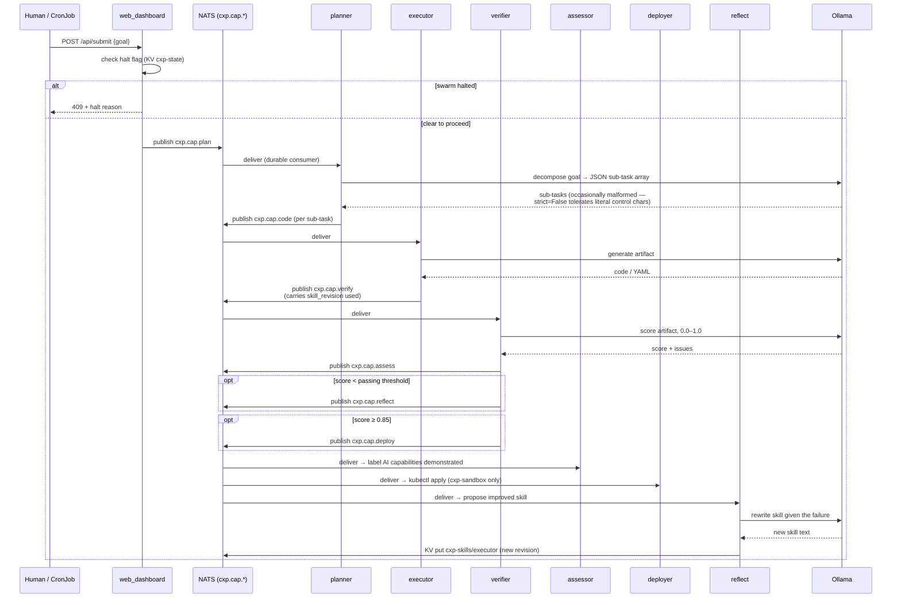
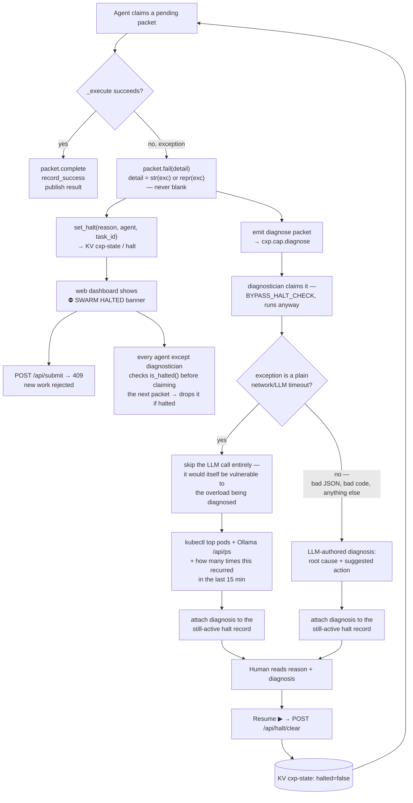
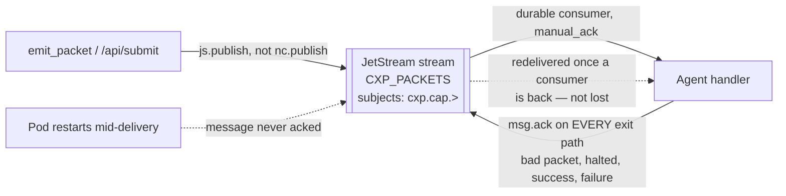

# CXP Architecture

Diagrams reflect the system as it actually runs today (post the 2026-08-16 fixes — shared skill propagation via NATS KV, the swarm-wide halt gate, JetStream-backed packet durability, and a second 2026-08-16 pass adding the `diagnostician` agent, three planner hardening fixes found live, and a total-duration cap on LLM calls). Where something changed, it's called out, since the "before" behavior is useful context for why the current design looks the way it does.

## Why this stack

**kind gives a real Kubernetes API, not a simplified one.** Everything exercised here — RBAC scoped to a namespace (`deployer-rbac.yaml`), rolling restarts, ConfigMap-driven code assembly, CronJob `backoffLimit`/`ttlSecondsAfterFinished` semantics, PVC access modes — behaves identically on a real cloud cluster. Nothing in this project is a kind-specific shortcut; it's Kubernetes running locally instead of on a cloud bill, so everything learned here transfers directly.

**NATS + JetStream does the job of three separate systems.** One lightweight binary serves:
- **plain pub/sub** for fan-out status/log streams (`cxp.dashboard`, `cxp.thinking`) that every dashboard viewer needs to see every event of,
- **a durable work queue** (JetStream stream + durable consumers, manual ack) for the actual task packets, so a packet published mid-rollout isn't silently lost,
- **a shared key-value store** (JetStream KV) for cross-replica state — skill text and the swarm halt flag — that would otherwise need something like Redis.

Most stacks reach for three different systems (a queue, a KV/cache, a coordination service) to cover what one NATS server covers here, with a client library (`nats-py`) that made the KV and durable-consumer code close to drop-in.

## 1. Components

```mermaid
graph TB
    subgraph human["Human / CronJob"]
        H[Human via Web UI]
        Cron[Hourly CronJob<br/>test-runner]
    end

    subgraph cxp["cxp namespace"]
        Web[web_dashboard<br/>FastAPI :8080]
        Term[dashboard.py<br/>terminal UI]

        subgraph nats["NATS + JetStream"]
            Stream[["stream CXP_PACKETS<br/>subjects cxp.cap.*<br/>durable consumers, manual ack"]]
            KVSkills[("KV cxp-skills")]
            KVCandidates[("KV cxp-skill-candidates")]
            KVEvaluations[("KV cxp-candidate-evaluations")]
            KVState[("KV cxp-state<br/>halt flag + Ollama slot claims")]
        end

        Planner[planner ×1]
        Executor[executor ×2]
        Verifier[verifier ×1]
        Assessor[assessor ×1]
        Reflect[reflect ×1]
        Deployer[deployer ×1<br/>+ kubectl binary]
        Diagnostician[diagnostician ×1<br/>+ kubectl binary, read-only<br/>BYPASS_HALT_CHECK]

        Ollama[[Ollama<br/>qwen2.5:1.5b]]
        OllamaSmall[[Ollama-small<br/>qwen2.5:0.5b]]
        Memory[("memory.json<br/>PVC, ReadWriteOnce")]
    end

    subgraph sandbox["cxp-sandbox namespace"]
        Applied[Deployments/Services/Pods<br/>applied by deployer only]
    end

    Metrics[["metrics-server<br/>kube-system"]]

    H -->|POST /api/submit| Web
    Cron -->|test suite, one at a time,<br/>waits for each to settle| Web
    Web -. checks before accepting .-> KVState
    Web -->|publish| Stream
    Stream --> Planner & Executor & Verifier & Assessor & Reflect & Deployer & Diagnostician

    Planner --> Ollama
    Executor --> Ollama
    Verifier --> Ollama
    Reflect --> Ollama
    Assessor --> OllamaSmall
    Diagnostician -.->|non-timeout halts only| Ollama
    Diagnostician -->|/api/ps, both instances| OllamaSmall

    Planner -->|emits code packets| Stream
    Executor -->|emits verify packet| Stream
    Verifier -->|emits assess + reflect + deploy packets| Stream
    Planner & Executor & Verifier & Assessor & Reflect & Deployer -->|on any unhandled error| Diagnostician

    Reflect -->|stages candidate| KVCandidates
    Planner & Executor & Verifier -. reads fresh, per task .-> KVSkills
    Cron -->|select one eligible executor candidate<br/>and compare held-out tests| KVCandidates
    Cron -->|write recommendation| KVEvaluations
    H -->|Promote recommended candidate| KVSkills

    Deployer -->|kubectl apply, score ≥ 0.85 only| Applied
    Diagnostician -->|kubectl top pods, read-only| Metrics
    Diagnostician -.->|attach diagnosis only —<br/>never clears the halt itself| KVState

    Planner & Executor & Verifier & Assessor & Reflect & Deployer & Diagnostician -->|reputation, always| Memory
    Planner & Executor & Verifier & Assessor & Reflect & Deployer -. checked before every packet .-> KVState
    Planner & Executor & Verifier & Assessor & Reflect & Deployer -->|set on unhandled error| KVState
```



**Notes:**
- `deployer` and `diagnostician` are the only two pods with a `kubectl` binary (downloaded at init time), each with its own ServiceAccount scoped by a separate Role/RoleBinding: `deployer` can create/update/delete in `cxp-sandbox` only; `diagnostician` can only `get`/`list` pods and pod metrics in the `cxp` namespace — read-only, nothing it can create, change, or delete. Neither can touch what the other is scoped to.
- **`diagnostician` is exempt from the halt-drops-every-packet rule** (`BYPASS_HALT_CHECK = True` on its `AgentShell` subclass) — its entire job is to investigate *while* the swarm is halted, so it can't be subject to the same rule that stops every other agent from claiming work during a halt.
- The memory PVC is `ReadWriteOnce`. That's only safe because the kind cluster is single-node; a real multi-node cluster would need `ReadWriteMany` or the KV-store pattern used for skills instead.
- **Two Ollama instances, split by model, not one shared instance.** `assessor` is the only agent on `qwen2.5:0.5b`, so it gets its own dedicated instance (`Ollama-small`, ~1.5 CPU/1.5Gi limit) separate from the one serving everyone else's `qwen2.5:1.5b` (~3.5 CPU/3Gi limit, shrunk from the single instance's earlier 5 CPU/4Gi so total demand stays about the same). Why: `verifier` fans out to `assessor` and `reflect` *simultaneously* on every single pass — two different models, same instant — and that pair kept colliding on one shared CPU allocation even after the single-instance resource limits were added. Two instances means that concurrent pair lands on two separate processes instead of queueing behind each other. Not "one Ollama per agent" (ruled out — six agents' worth of loaded models would need ~9GB against a 7.7GB-total node); just splitting by which model is actually in play.
- "reputation, always" in the diagram is a simplification: every agent writes reputation on every packet (`record_success`/`record_failure`), but only `verifier` writes the structured `episodic` entries (`{capability, skill_revision, score, goal}`) used for regression detection, and only `reflect`/`assessor` write `semantic` facts (free-text notes). Same file (`memory.json`), three different record types, written by different agents.
- **A real concurrency limit was still routing around resource limits.** Even with two Ollama instances and CPU limits, agents were calling `self.llm()` freely — no coordination across pods about how many were hitting the same instance at once. Ollama itself queues correctly beyond its configured `OLLAMA_NUM_PARALLEL`, but the *client's* per-chunk timeout couldn't tell "queued, waiting its turn" from "actually stuck." `acquire_ollama_slot()`/`release_ollama_slot()` (`agent_shell.py`, backed by a claims list in `KV cxp-state`) make every agent block on a *confirmed* free slot — checked by short polling against real claims, not a fixed timer — before ever starting the timed HTTP call. A claim older than `OLLAMA_SLOT_STALE_SECONDS` (280s) is pruned automatically, so a pod that gets killed mid-request doesn't leak that slot forever.

## 2. One task, start to finish



Every producing agent records raw/normalized contract evidence in bounded durable attempt memory. `verifier` also logs `{capability, skill_revision, score, goal}` to episodic memory. A candidate is not a live rewrite: after the ordinary hourly suite, `evaluate_candidate.py` selects at most one healthy **executor** candidate with deterministic-validator evidence, runs a held-out active-versus-candidate comparison, and writes its recommendation to `cxp-candidate-evaluations`. The dashboard exposes that report; a human promotion is the only operation that writes candidate content into `cxp-skills`. Planner/verifier candidates remain staged for review until isolated evaluators exist for those roles.

## 3. Halt gate



Before the halt gate existed at all, every failure was logged and silently forgotten — the swarm just kept consuming new work regardless of whether the last thing it did actually worked. `diagnostician` (added 2026-08-16) investigates every halt and always attaches a real diagnosis — including whether the same failure class has recurred multiple times in the last 15 minutes — but **it never clears a halt itself**, timeout-class or not. An earlier version of this agent did auto-clear plain timeouts without a human; rolled back the same day, deliberately: even a well-understood, frequently-recurring failure could be an early sign of something worse, and that call belongs to a human, not the swarm. `diagnostician` narrows the *investigation* work a human has to do — it doesn't remove the human from the loop.

## 4. Packet durability



Before this, publish was fire-and-forget core NATS pub/sub: a packet published while no replica happened to be subscribed (mid-rollout, restart) was simply gone, with no record it ever existed. Redelivery here is deliberately narrow — it rescues a packet whose delivery attempt never *finished*, not a packet whose processing *failed*. Failures are the halt gate's job; acking on every exit path (including halted-drop and bad-packet paths) prevents a genuinely-failed packet from redelivering forever and spamming the same error.

**`ack_wait` has to exceed the slowest legitimate LLM call, or redelivery causes duplicate processing instead of preventing lost work.** Consumers are configured with `ack_wait=300s` — the default (30s) is shorter than LLM calls have taken under real contention (observed 3-4 minutes), so JetStream was redelivering a message to another replica *while the first was still slowly processing it*, not lost but processed twice. Separately: recreating an existing durable consumer (e.g. to change its config) defaults to `deliver_policy=all`, replaying the *entire* stream history from the beginning — this caused a one-time burst of stale redeliveries the first time these consumers were recreated to apply the `ack_wait` fix. `deliver_policy=new` avoids that on any future consumer change.

**`ack_wait` alone doesn't bound a hung LLM call — it bounds how long JetStream waits before assuming a delivery attempt died.** Found live (2026-08-16): `self.llm()`'s httpx timeout (`read=60.0`) is a *per-chunk* timeout — it only fires if literally no data arrives for 60s. A response trickling back even one token every ~59s never trips it and can hang indefinitely, well past `ack_wait`, with the message never acked *and* never redelivered (the original delivery attempt is still technically "in progress," just stuck). Found live under sustained real load (2026-08-17): even a padded 240s total-call budget isn't enough on its own — real requests kept completing successfully within a couple seconds of that line (observed up to 239s), meaning legitimate work under real CPU-only load routinely needs several minutes, and no fixed number was going to feel right. `acquire_ollama_slot()`/`release_ollama_slot()` (a JetStream KV semaphore matching Ollama's real `OLLAMA_NUM_PARALLEL` capacity) separately fixed the *queueing* half of this — agents wait for a confirmed free slot before ever starting the timed call, instead of a request sitting queued while its clock runs out underneath it.

**The actual fix for "how long can a legitimate call take" turned out to be decoupling it from `ack_wait` entirely, not picking a bigger number.** `handle()` now runs a background heartbeat (`msg.in_progress()` every 90s, well under `ack_wait`'s 300s) for as long as `_execute()` is genuinely still running — this tells JetStream "still alive, don't redeliver" independent of how long the LLM call itself takes. `LLM_TOTAL_TIMEOUT` is now `900.0`, a generous "something is definitely wrong" backstop rather than a tight guess coupled to `ack_wait` — a real generation can take as long as it actually needs, and only a pod that's genuinely crashed (heartbeats stop with it) still triggers JetStream's normal redelivery, exactly the resilience `ack_wait` was built for in the first place.

## Is this actually a protocol?

Honestly: not yet. "CXP — Context Exchange Protocol" describes the ambition more than the current reality. What exists today is `src/packet.py`'s `CXPPacket` — a Pydantic model this one codebase uses internally. It's a genuinely reasonable *schema* (typed, self-tracing via `TraceEntry`, carries its own status/TTL), but it isn't a *protocol* by the usual bar for that word:

- **No spec independent of the implementation.** The only definition of a CXP packet is the Python class itself. Nothing describes the wire format in a way another language could implement against without reading `packet.py`.
- **No version number.** If `Payload` gains or drops a field, there's no mechanism for an old and new packet to declare compatibility, or for a consumer to know which shape it's looking at.
- **No second implementation.** Nothing outside this repo has ever produced or consumed a CXP packet. A protocol with exactly one participant is just an internal format.

### If this became a real spec (future idea, not built)

The concrete path, sketched here rather than implemented, since it's a real chunk of work not blocking anything today:

1. **A standalone spec document** (`docs/protocol-spec.md`), independent of Python — field names, types, required vs. optional, and semantics, written the way you'd document a wire format for someone who will never see the Pydantic source. Something like:

   ```
   CXP Packet v1
   {
     id: string (uuid)              — unique per packet
     schema_version: string          — "1.0" — NEW field, doesn't exist today
     type: enum(plan|code|verify|reflect|assess|deploy|memory|route)
     capability: string              — routing key, matches "cxp.cap.<capability>"
     status: enum(pending|in_progress|done|error)
     payload: { goal, context, instructions, inputs, output, error_detail }
     trace: [{ agent, action, timestamp, notes }]
   }
   ```

2. **A `schema_version` field on `CXPPacket` itself**, so a future breaking change to `Payload` can be detected and handled (or rejected) by a consumer instead of silently misinterpreted.
3. **One real external consumer** — even something trivial, like a 20-line script in a different language that constructs a valid packet from the spec alone (no access to `packet.py`) and publishes it to `cxp.cap.plan`, then reads back a result. That's the actual bar for "protocol": something other than this codebase can speak it.

None of this is needed for the swarm to keep working — it's purely about whether the name matches the artifact. Worth doing if CXP is ever meant to be adopted by anything outside this repo; not worth doing just for its own sake.
