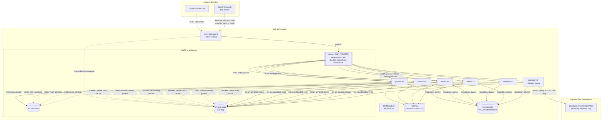
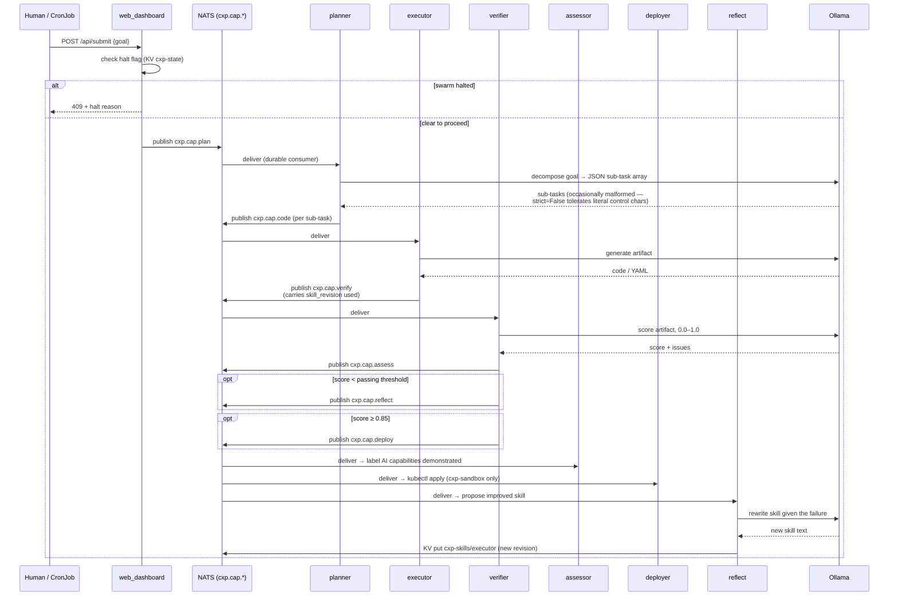
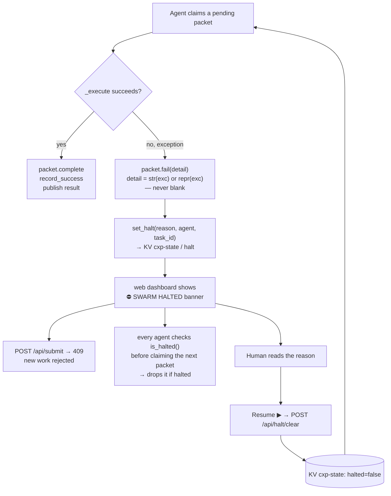
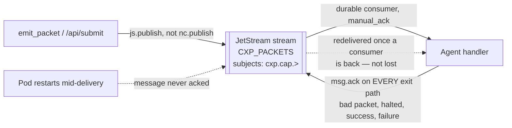

# CXP Architecture

Diagrams reflect the system as it actually runs today (post the 2026-08-16 fixes — shared skill propagation via NATS KV, the swarm-wide halt gate, JetStream-backed packet durability). Where something changed, it's called out, since the "before" behavior is useful context for why the current design looks the way it does.

## Why this stack

**kind gives a real Kubernetes API, not a simplified one.** Everything exercised here — RBAC scoped to a namespace (`deployer-rbac.yaml`), rolling restarts, ConfigMap-driven code assembly, CronJob `backoffLimit`/`ttlSecondsAfterFinished` semantics, PVC access modes — behaves identically on a real cloud cluster. Nothing in this project is a kind-specific shortcut; it's Kubernetes running locally instead of on a cloud bill, so everything learned here transfers directly.

**NATS + JetStream does the job of three separate systems.** One lightweight binary serves:
- **plain pub/sub** for fan-out status/log streams (`cxp.dashboard`, `cxp.thinking`) that every dashboard viewer needs to see every event of,
- **a durable work queue** (JetStream stream + durable consumers, manual ack) for the actual task packets, so a packet published mid-rollout isn't silently lost,
- **a shared key-value store** (JetStream KV) for cross-replica state — skill text and the swarm halt flag — that would otherwise need something like Redis.

Most stacks reach for three different systems (a queue, a KV/cache, a coordination service) to cover what one NATS server covers here, with a client library (`nats-py`) that made the KV and durable-consumer code close to drop-in.

## 1. Components



**Notes:**
- `deployer` is the only pod with a `kubectl` binary (downloaded at init time) and a ServiceAccount — via a Role/RoleBinding — scoped only to `cxp-sandbox`. It cannot touch the `cxp` namespace the agents run in.
- The memory PVC is `ReadWriteOnce`. That's only safe because the kind cluster is single-node; a real multi-node cluster would need `ReadWriteMany` or the KV-store pattern used for skills instead.
- "reputation, always" in the diagram is a simplification: every agent writes reputation on every packet (`record_success`/`record_failure`), but only `verifier` writes the structured `episodic` entries (`{capability, skill_revision, score, goal}`) used for regression detection, and only `reflect`/`assessor` write `semantic` facts (free-text notes). Same file (`memory.json`), three different record types, written by different agents.

## 2. One task, start to finish



`verifier` also logs `{capability, skill_revision, score, goal}` to episodic memory on every packet — the only way to actually measure whether a given skill revision produced better scores than the last, instead of assuming the loop is helping.

## 3. Halt gate



Before this existed, every failure was logged and silently forgotten — the swarm just kept consuming new work regardless of whether the last thing it did actually worked.

## 4. Packet durability



Before this, publish was fire-and-forget core NATS pub/sub: a packet published while no replica happened to be subscribed (mid-rollout, restart) was simply gone, with no record it ever existed. Redelivery here is deliberately narrow — it rescues a packet whose delivery attempt never *finished*, not a packet whose processing *failed*. Failures are the halt gate's job; acking on every exit path (including halted-drop and bad-packet paths) prevents a genuinely-failed packet from redelivering forever and spamming the same error.

**`ack_wait` has to exceed the slowest legitimate LLM call, or redelivery causes duplicate processing instead of preventing lost work.** Consumers are configured with `ack_wait=300s` — the default (30s) is shorter than LLM calls have taken under real contention (observed 3-4 minutes), so JetStream was redelivering a message to another replica *while the first was still slowly processing it*, not lost but processed twice. Separately: recreating an existing durable consumer (e.g. to change its config) defaults to `deliver_policy=all`, replaying the *entire* stream history from the beginning — this caused a one-time burst of stale redeliveries the first time these consumers were recreated to apply the `ack_wait` fix. `deliver_policy=new` avoids that on any future consumer change.

## Is this actually a protocol?

Honestly: not yet. "CXP — Context Exchange Protocol" describes the ambition more than the current reality. What exists today is `src/packet.py`'s `CXPPacket` — a Pydantic model this one codebase uses internally. It's a genuinely reasonable *schema* (typed, self-tracing via `TraceEntry`, carries its own status/TTL), but it isn't a *protocol* by the usual bar for that word:

- **No spec independent of the implementation.** The only definition of a CXP packet is the Python class itself. Nothing describes the wire format in a way another language could implement against without reading `packet.py`.
- **No version number.** If `Payload` gains or drops a field, there's no mechanism for an old and new packet to declare compatibility, or for a consumer to know which shape it's looking at.
- **No second implementation.** Nothing outside this repo has ever produced or consumed a CXP packet. A protocol with exactly one participant is just an internal format.

### If this became a real spec (future idea, not built)

The concrete path, sketched here rather than implemented, since it's a real chunk of work not blocking anything today:

1. **A standalone spec document** (`docs/protocol-spec.md`), independent of Python — field names, types, required vs. optional, and semantics, written the way you'd document a wire format for someone who will never see the Pydantic source. Something like:

   ```
   CXP Packet v1
   {
     id: string (uuid)              — unique per packet
     schema_version: string          — "1.0" — NEW field, doesn't exist today
     type: enum(plan|code|verify|reflect|assess|deploy|memory|route)
     capability: string              — routing key, matches "cxp.cap.<capability>"
     status: enum(pending|in_progress|done|error)
     payload: { goal, context, instructions, inputs, output, error_detail }
     trace: [{ agent, action, timestamp, notes }]
   }
   ```

2. **A `schema_version` field on `CXPPacket` itself**, so a future breaking change to `Payload` can be detected and handled (or rejected) by a consumer instead of silently misinterpreted.
3. **One real external consumer** — even something trivial, like a 20-line script in a different language that constructs a valid packet from the spec alone (no access to `packet.py`) and publishes it to `cxp.cap.plan`, then reads back a result. That's the actual bar for "protocol": something other than this codebase can speak it.

None of this is needed for the swarm to keep working — it's purely about whether the name matches the artifact. Worth doing if CXP is ever meant to be adopted by anything outside this repo; not worth doing just for its own sake.
